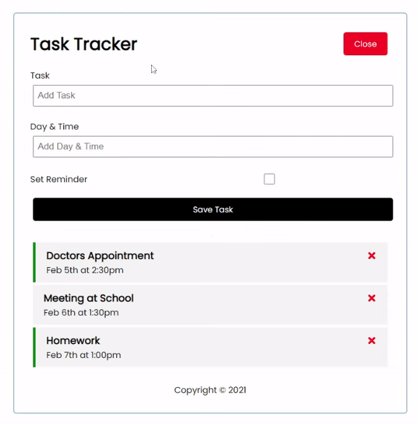

# React Task Tracker


## Description
A React.js application for tracking tasks and setting reminders.

## Table of Contents
* [Links](#links)
* [Animation](#animation) 
* [Instructions](#instructions)
* [Installation](#installation)
* [Tests](#tests)
* [Contribute](#contribute) 
* [Technologies](#technologies)  
* [License](#license)
* [Contact](#contact)

## Links
Repository: [https://github.com/spencercreer/react-task-tracker](https://github.com/spencercreer/react-task-tracker)

## Animation
The following animation demonstrates the application functionality:
<br>


## Instructions
TBD

## Installation
This application utilizes the following dependencies:
* json-server
* react
* react-dom
* react-icons
* react-router-dom
* react-scripts
* web-vitals

To install the necessary dependencies, run the following command:

  ```
  npm install
  ```

## Tests
To run tests, run the following command:

  ```
  TBD
  ```
    
## Contribute
Please submit a PR if you would like to contribute.

## Technologies
 * React

## License
This project is licensed under the MIT license.

## Contact
For questions or comments, please contact me.

Email: <a href="mailto: spencercreer@gmail.com" target="_blank">spencercreer@gmail.com</a>

GitHub: [spencercreer](https://github.com/spencercreer/)
